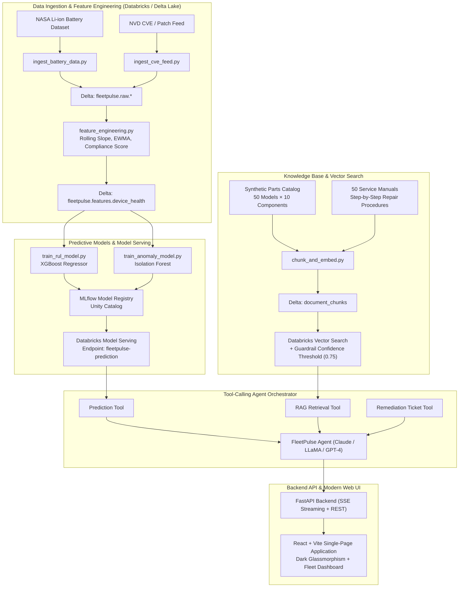
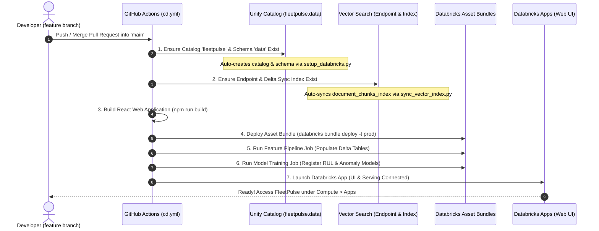

# ⚡ FleetPulse — Agentic Enterprise Mobile Device Management (MDM)

[](.github/workflows/ci.yml)
[](https://databricks.com)
[](https://fastapi.tiangolo.com)
[](https://vitejs.dev)

> **FleetPulse** is an enterprise MDM agentic system. It predicts device health and compliance degradation (battery capacity fade, patch lag, compliance drift) *before* failure occurs, and empowers IT operations to take immediate action — retrieving replacement parts and step-by-step repair manuals via a confidence-guardrailed RAG layer and drafting remediation tickets through a conversational web UI.

---

## 🏗️ System Architecture



---

## 🚀 Key Capabilities

1. **Predictive Degradation Modeling**:
   - Predicts **Remaining Useful Life (RUL)** in days using an XGBoost regressor trained on cycle-level degradation telemetry.
   - Flags sudden cliffs and configuration compromises using an **Isolation Forest** anomaly detector.
   - Quantifies primary driving factors per device (e.g., `capacity_fade_rate`, `days_since_last_patch`).

2. **RAG Hardware Lookup with Guardrail Protection**:
   - Vector search index over structured parts catalog (436 parts across 50 device models) and 50 comprehensive OEM repair manuals.
   - **Confidence Threshold Guardrail (0.75)**: Strictly rejects low-confidence matches with `"Escalate to IT team"` to guarantee **zero hallucinated hardware part numbers or dangerous repair procedures**.

3. **Tool-Calling Agent Orchestration**:
   - Coordinates `get_fleet_prediction`, `get_device_repair_info`, and `draft_remediation_ticket`.
   - Generates formatted enterprise remediation tickets (priority levels P1–P4, root cause, estimated downtime, required tools, and checklist).

4. **Modern High-Performance Web UI**:
   - Dark theme glassmorphism interface built with React and Vite.
   - Interactive fleet health overview: risk distribution breakdown, area trend charts (via Recharts), and device health risk cards.
   - Real-time conversational streaming with tool indicator badges, rich part cards, and one-click ticket copy/export.

---

## 📂 Repository Structure

```
FleetPulse/
├── databricks.yml                        # Databricks Asset Bundle configuration
├── bundle/
│   ├── resources.yml                     # Databricks Workflows, Jobs, and Model Serving
│   └── permissions.yml                   # Environment access control rules
├── src/
│   ├── pipelines/                        # Phase 1: Data & Feature Engineering
│   │   ├── ingest_battery_data.py        # PySpark NASA battery cycle ingestion
│   │   ├── ingest_cve_feed.py            # PySpark NVD CVE vulnerability ingestion
│   │   ├── feature_engineering.py        # PySpark rolling degradation & compliance features
│   │   └── utils/                        # StructType schemas & PySpark UDFs
│   ├── models/                           # Phase 2: Predictive Models
│   │   ├── train_rul_model.py            # XGBoost RUL regressor + MLflow tracking
│   │   ├── train_anomaly_model.py        # Isolation Forest detector + MLflow
│   │   ├── evaluate.py                   # Model evaluation & holdout comparison
│   │   └── serve/predict.py              # Databricks Model Serving inference handler
│   ├── rag/                              # Phase 3: RAG Knowledge Base
│   │   ├── generate_parts_catalog.py     # Generates parts catalog (436 parts, 50 models)
│   │   ├── generate_service_manuals.py   # Generates 50 markdown service manuals
│   │   ├── chunk_and_embed.py            # Text chunker & sentence embeddings
│   │   ├── index_vector_search.py        # Databricks Vector Search sync
│   │   └── retriever.py                  # Retriever with confidence guardrail
│   ├── agent/                            # Phase 4: Tool-Calling Agent Layer
│   │   ├── agent.py                      # Multi-round tool calling orchestrator
│   │   ├── llm_adapter.py               # Provider-agnostic adapter (Anthropic/OpenAI/Databricks)
│   │   ├── prompts.py                    # Agent system prompts and few-shot examples
│   │   └── tools/                        # Prediction, RAG, and Ticketing tools
│   └── api/                              # Phase 5: FastAPI Backend
│       ├── main.py                       # Application entry point with CORS
│       ├── models.py                     # Pydantic schemas
│       └── routes/                       # /health, /fleet, and /chat (SSE streaming)
├── ui/                                   # Phase 6: React + Vite Web UI
│   ├── src/components/                   # ChatPanel, FleetDashboard, PartInfo, TicketPreview
│   └── src/hooks/                        # useChat, useFleetData
├── tests/                                # Phase 9: Automated Test Suite (16 Unit & Integration Tests)
├── notebooks/                            # Databricks Interactive Exploration Notebooks
├── .github/workflows/                    # Phase 8: CI/CD (Lint, Test, Bundle Validate, Deploy)
├── requirements.txt
└── pyproject.toml
```

---

## 🛠️ How to Run Locally

### 1. Setup Python Environment
```bash
# Clone repository and navigate to root
cd FleetPulse

# Install Python dependencies
pip install -r requirements.txt
```

### 2. Generate Synthetic RAG Corpus
```bash
# Generates parts catalog and 50 service manuals
python -m src.rag.generate_parts_catalog
python -m src.rag.generate_service_manuals
```

### 3. Run Automated Tests
```bash
# Run pytest test suite (16 tests across Agent, Models, RAG, and API)
python -m pytest tests/ -v
```

### 4. Start the Backend API Server
```bash
# Start FastAPI backend on http://localhost:8000
python -m uvicorn src.api.main:app --reload --port 8000
```
Interactive Swagger documentation will be available at [http://localhost:8000/docs](http://localhost:8000/docs).

### 5. Start the Web UI
In a separate terminal:
```bash
cd ui
npm install
npm run dev
```
Open [http://localhost:5173](http://localhost:5173) in your browser.

---

## ☁️ Deploying to Databricks (Databricks Apps)

FleetPulse is deployed to Databricks using **Databricks Asset Bundles (DABs)** and hosted natively using **Databricks Apps**:

### Architecture on Databricks:
- **Full-Stack Hosting**: The React UI (`ui/dist`) is served by FastAPI as a unified service via **Databricks Apps** (`app.yaml`).
- **Workspace Authentication**: Automatically protected by Databricks SSO / OAuth without managing external reverse proxies.
- **Internal Service Mesh**: Directly interfaces with Databricks Model Serving (`fleetpulse-prediction`) and Databricks Vector Search (`fleetpulse-vs-endpoint`).

### Deployment Steps:

1. **Configure Databricks CLI**:
   ```bash
   databricks auth login --host https://<your-workspace-url>.cloud.databricks.com
   ```

2. **Build Frontend & Validate Bundle**:
   ```bash
   cd ui && npm install && npm run build && cd ..
   databricks bundle validate -t dev
   ```

3. **Deploy Pipeline, Serving Endpoints & Databricks App**:
   ```bash
   databricks bundle deploy -t dev
   ```

4. **Access the Application**:
   Open the Databricks Workspace $\rightarrow$ **Compute** $\rightarrow$ **Apps** $\rightarrow$ `fleetpulse-dev` to launch the conversational web UI.

5. **Run Feature Pipeline Job**:
   ```bash
   databricks bundle run fleetpulse_feature_pipeline -t dev
   ```

---

## 🔄 Automated Git Merge Workflow (`feature` → `main`)

When you push or merge a **feature branch into `main`**, GitHub Actions orchestrates the automated creation and configuration of all Databricks components without manual intervention:



### GitHub Secrets Required in Your Repository:
- `DATABRICKS_HOST`: Your workspace URL (`https://dbc-dc308f9e-fcc1.cloud.databricks.com/`)
- `DATABRICKS_TOKEN`: Your personal access token or service principal token (`dapi...`)

